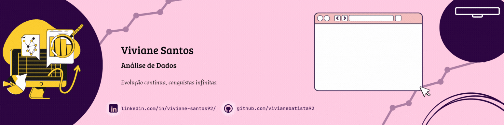

  

#

Bacharel em Administração e estudante do programa Oracle Next Education (ONE) com foco em Análise de Dados. Estudo SQL e Power BI para construir dashboards e gerar insights estratégicos. Tenho interesse em inteligência de negócios e na transformação de dados em informação valiosa. Busco aprendizado contínuo para aplicar tecnologia na tomada de decisões. 

#

<h3 align="left">Connect with me!</h3>

<h3 align="left">My Stack ~</h3>

   
  
  
  
  
  

#

<picture align="center">
  <source media="(prefers-color-scheme: dark)" srcset="https://raw.githubusercontent.com/vivianebatista92/vivianebatista92/output/github-contribution-grid-snake-dark.svg">
  <source media="(prefers-color-scheme: light)" srcset="https://raw.githubusercontent.com/vivianebatista92/vivianebatista92/output/github-contribution-grid-snake-dark.svg">
  
</picture>

#

  <h3>* GitHub Stats *</h3>
   
  

  

